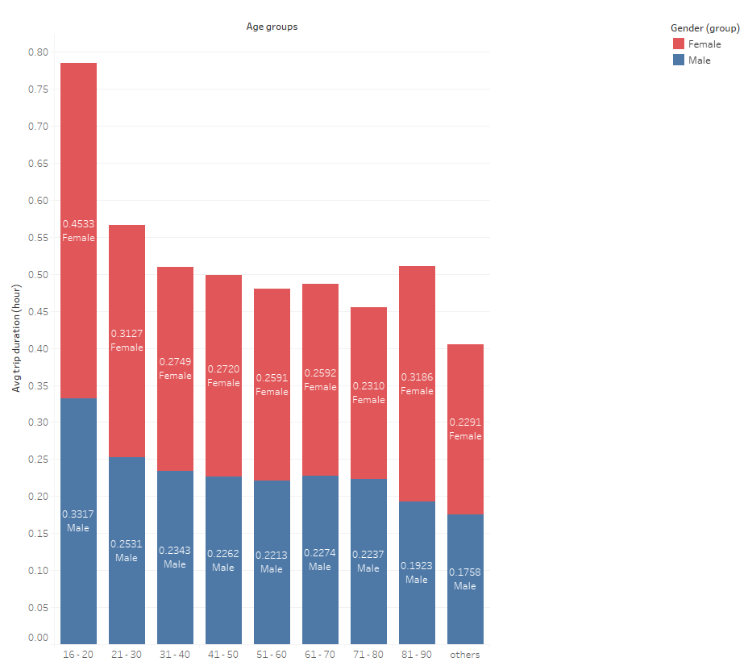
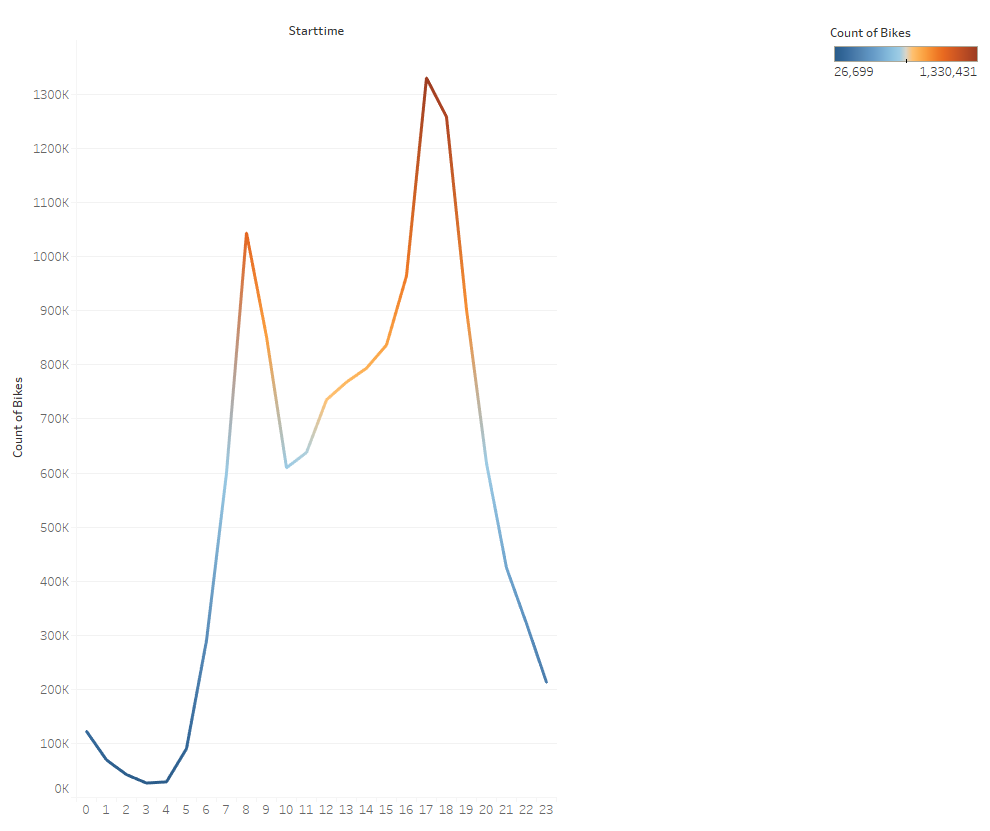
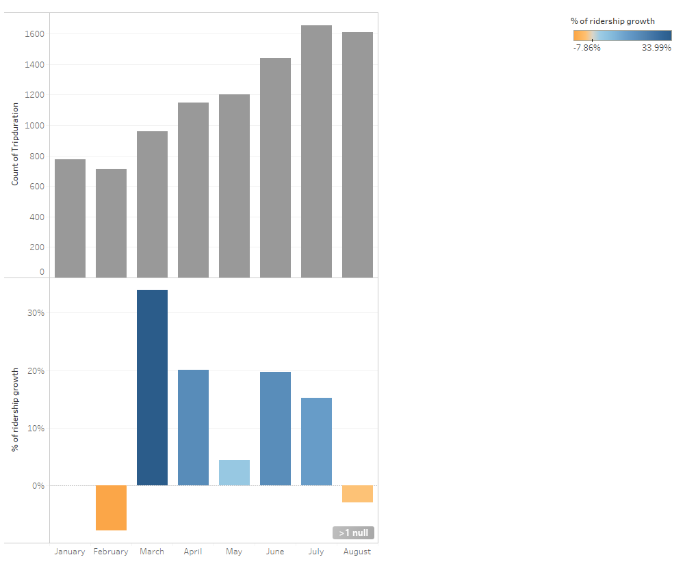
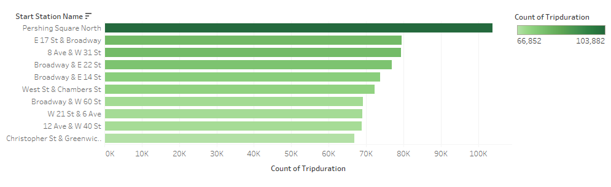
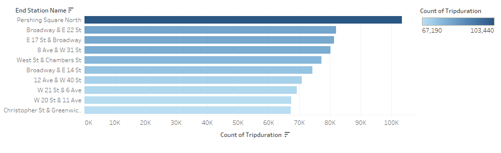

# New York Citi Bike Analysis (Tableau)

## Background

Since 2013, the Citi Bike Program has implemented a robust infrastructure for collecting data on the program's utilization. Through the team's efforts, each month bike data is collected, organized, and made public on the [Citi Bike Data](https://www.citibikenyc.com/system-data) webpage.

## Project outline:

This project is to aggregate the data found in the Citi Bike Trip History Logs (January - August, 2019) and generate a report that shows data visualizations to find unexpected phenomena.

The result of this project is posted on the Tableau Public. This project only focuses on the timespan from January, 2019 to August, 2019 due to limition of Tableau Public (maximum: 15,000,000 rows).

* Click [here](https://public.tableau.com/views/NY_Citi_Bike_AnalyticsJan-Aug_2019_15886174867250/2019Q1-Q3NYCItiBikeAnalysis?:display_count=y&:origin=viz_share_link) to view the result

## Data source:
The files below are the data sets used in this project. They are from the [Citi Bike Data download](https://s3.amazonaws.com/tripdata/index.html) webpage.

| Name | Date Modified | Size | Type |
| :---: | :---: | :---: | :---: |
| 201902-citibike-tripdata.csv.zip | Mar 4th 2019, 08:21:38 am | 40.47 MB | ZIP file |
| 201903-citibike-tripdata.csv.zip | Apr 15th 2019, 11:34:41 am | 57.20 MB | ZIP file |
| 201904-citibike-tripdata.csv.zip | May 6th 2019, 12:07:32 pm | 75.70 MB | ZIP file |
| 201905-citibike-tripdata.csv.zip | Jun 11th 2019, 12:37:54 pm | 82.18 MB | ZIP file |
| 201906-citibike-tripdata.csv.zip | Jul 15th 2019, 10:42:08 am | 91.08 MB | ZIP file |
| 201907-citibike-tripdata.csv.zip | Aug 5th 2019, 02:34:01 pm | 93.36 MB | ZIP file |
| 201908-citibike-tripdata.csv.zip | Sep 18th 2019, 01:33:14 pm | 100.02 MB | ZIP file |

## Findings:

* The young male and female groups between 16 - 20 tend to use Citi Bikes for longer trip duration than other age groups. Female riders overall tend to ride Citi Bikes longer than male riders.

* The 1st and 2nd peak hours in the 8 months were 7-8 am and 4-5 pm.

* The highest ridership growth rate was in March 2019. The ridership growth started increasing from March to July 2019. After July, the ridership growth rate and number of usage started decreasing. As the temperature gets warmer, people tend to ride bikes more. This showed that the temperture may play a big role in the ridership growth.

* Top 10 stations to start bike trips

* Top 10 stations to end bike trips

## Technology used:
* Tableau

